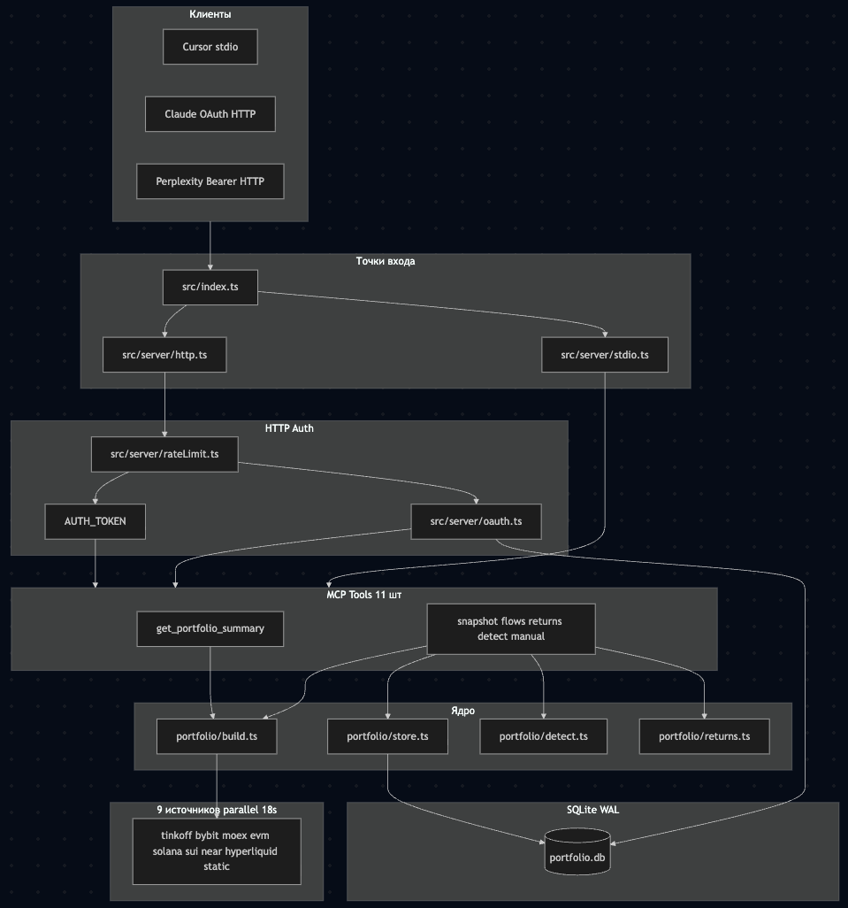
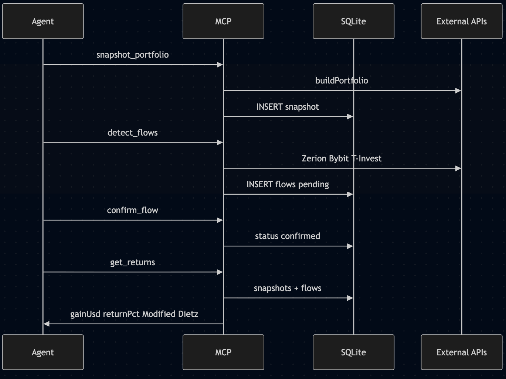

# portfolio-mcp — документация сервиса

Полное руководство по архитектуре, конфигурации, безопасности и деплою MCP-сервера личного инвестиционного портфеля.

Краткий quick-start — в [README.md](README.md).

---

## 1. Обзор

**portfolio-mcp** (репозиторий `mcp-capital`) — однопользовательский MCP-сервер, который:

- собирает позиции из брокеров, CEX и блокчейнов в единый JSON-снимок;
- считает аллокацию, USD/RUB totals, breakdown по источникам;
- хранит snapshots и cash flows в SQLite для расчёта доходности (Modified Dietz);
- автоматически детектирует внешние депозиты/выводы (EVM, Bybit, T-Invest).

**Стек:** Bun, `@modelcontextprotocol/sdk`, TypeScript (strict), Zod, SQLite (`bun:sqlite`).

**Транспорты:**

| Режим          | Запуск                | Auth                                |
| -------------- | --------------------- | ----------------------------------- |
| HTTP (default) | `bun run start`       | Обязателен `AUTH_TOKEN` и/или OAuth |
| stdio          | `bun run start:stdio` | Нет (доверие к локальному процессу) |

---

## 2. Архитектура



### Жизненный цикл запроса `get_portfolio_summary`

1. MCP-клиент вызывает инструмент (stdio или `POST /mcp`).
2. `buildPortfolio()` выбирает источники (все 9 или фильтр `includeSources`).
3. `Promise.allSettled` — параллельный fetch с таймаутом **18 с** на источник.
4. Агрегация: totals, `sourceBreakdown`, `allocation`, список позиций.
5. Курс USD/RUB — live CBR (`lib/usdRub.ts`), кэш на время процесса.
6. Фильтрация по `minValueUsd` (default $1), compact JSON в ответ.

Worst-case latency: ~18 с.

### Return tracking workflow



1. **`snapshot_portfolio`** — сохраняет текущий портфель в SQLite.
2. **`detect_flows`** — сканирует EVM/Bybit/T-Invest, пишет pending flows.
3. **`confirm_flow`** / **`reject_flow`** — ревью перед учётом в returns.
4. **`get_returns`** — Modified Dietz между snapshots, net of confirmed flows.

---

## 3. Конфигурация

Скопируйте `.env.example` → `.env` и заполните ключи.

### Источники данных

| Переменная           | Нужна для         | Описание                                      |
| -------------------- | ----------------- | --------------------------------------------- |
| `TINKOFF_TOKEN`      | tinkoff           | API token T-Invest                            |
| `TINKOFF_ACCOUNT_ID` | tinkoff           | Optional CSV account IDs; иначе auto-discover |
| `BYBIT_API_KEY`      | bybit             | Read-only API key                             |
| `BYBIT_API_SECRET`   | bybit             | HMAC secret                                   |
| `ZERION_API_KEY`     | evm, detect_flows | Zerion developer key                          |
| `EVM_WALLET_1`       | evm               | 0x...                                         |
| `EVM_WALLET_2`       | evm               | 0x...; fallback для Hyperliquid               |
| `SOLANA_WALLET`      | solana            | base58                                        |
| `HELIUS_API_KEY`     | solana            | Helius DAS                                    |
| `SUI_WALLET`         | sui               | 0x...                                         |
| `NEAR_WALLET`        | near              | account.near                                  |
| `HYPERLIQUID_WALLET` | hyperliquid       | Optional; default = `EVM_WALLET_2`            |
| `MANUAL_POSITIONS`   | static            | JSON array ручных позиций                     |
| `OWN_ADDRESSES`      | detect_flows      | CSV доп. «своих» адресов для netting          |

Без ключа: MOEX ISS, CBR FX, CoinGecko, Jupiter, Sui/NEAR RPC, Hyperliquid info API.

### Сервер HTTP

| Переменная                  | Default               | Описание                                            |
| --------------------------- | --------------------- | --------------------------------------------------- |
| `PORT`                      | `3000`                | HTTP port                                           |
| `HOST`                      | `127.0.0.1`           | Bind address                                        |
| `MCP_TRANSPORT`             | —                     | `stdio` → stdio mode                                |
| `ALLOWED_ORIGINS`           | `*`                   | CORS, comma-separated                               |
| `AUTH_TOKEN`                | —                     | Static Bearer для `/mcp`                            |
| `OAUTH_CLIENT_ID`           | —                     | OAuth (вместе с SECRET)                             |
| `OAUTH_CLIENT_SECRET`       | —                     | OAuth client secret                                 |
| `OAUTH_ISSUER`              | derived               | Public URL за reverse proxy                         |
| `OAUTH_REDIRECT_URIS`       | —                     | **Обязателен** при OAuth; whitelist redirect URIs   |
| `OAUTH_REFRESH_TTL_DAYS`    | `90`                  | TTL refresh token                                   |
| `OAUTH_REGISTRATION_SECRET` | —                     | Optional; `/register` отдаёт secret только с header |
| `RATE_LIMIT_MCP`            | `30`                  | req/min на `/mcp` per IP                            |
| `RATE_LIMIT_OAUTH`          | `20`                  | req/min на OAuth paths per IP                       |
| `DB_PATH`                   | `./data/portfolio.db` | SQLite file                                         |

**HTTP не стартует** без `AUTH_TOKEN` или пары `OAUTH_CLIENT_ID` + `OAUTH_CLIENT_SECRET`.

### Ручные позиции

1. `positions.local.json` (gitignored) — см. [positions.local.example.json](positions.local.example.json)
2. `MANUAL_POSITIONS` env — JSON array того же формата

Формат записи: `{ ticker, name, valueRub?|value?, category?, currency?, description? }`

---

## 4. Источники данных

| ID            | Модуль                   | Что читает                    | Auth             |
| ------------- | ------------------------ | ----------------------------- | ---------------- |
| `tinkoff`     | `sources/tinkoff.ts`     | T-Invest, все аккаунты        | `TINKOFF_TOKEN`  |
| `bybit`       | `sources/bybit.ts`       | Wallet + perps + Earn         | HMAC             |
| `moex`        | `sources/moex.ts`        | AKMM через ISS                | keyless          |
| `evm`         | `sources/evm.ts`         | 2 кошелька + DeFi (Zerion)    | `ZERION_API_KEY` |
| `solana`      | `sources/solana.ts`      | SOL + SPL (Helius + Jupiter)  | `HELIUS_API_KEY` |
| `sui`         | `sources/sui.ts`         | Spot coins                    | keyless RPC      |
| `near`        | `sources/near.ts`        | NEAR + FT + staking           | keyless          |
| `hyperliquid` | `sources/hyperliquid.ts` | Perps + spot + vaults         | keyless          |
| `static`      | `sources/static.ts`      | Ручные позиции из DB/file/env | local            |

### Известные ограничения

- **Sui AlphaLend** — DeFi позиция не оценивается (нет free REST API).
- **Hyperliquid spot** — токены без ликвидной USD-пары = $0.
- **MOEX** — количество AKMM захардкожено в `moex.ts` (персональный параметр).
- **CoinGecko** — free tier ~30 req/min.

---

## 5. MCP Tools Reference

### 5.1 `get_portfolio_summary`

Live snapshot портфеля без записи в БД.

```json
{
  "includeSources": ["tinkoff", "bybit"],
  "minValueUsd": 1
}
```

Ответ: `timestamp`, `totalValueUsd`, `totalValueRub`, `sourceBreakdown`, `allocation`, `positions[]`, `hiddenBelowThreshold`, `errors[]`.

### 5.2 `snapshot_portfolio`

```json
{ "trigger": "on_chat" }
```

Triggers: `on_chat` (≤1/час), `daily`, `month_start`, `month_end`, `manual`.

### 5.3 `record_flow`

Внешний deposit/withdraw (не переводы между своими счетами).

```json
{
  "direction": "deposit",
  "amountUsd": 1000,
  "source": "bybit",
  "note": "salary"
}
```

### 5.4 `get_returns`

Modified Dietz между двумя snapshots, net of flows.

```json
{ "period": "30d" }
```

Periods: `today`, `7d`, `30d`, `mtd`, `ytd`, `all`. Или `from`/`to` ISO-8601.

### 5.5 `detect_flows`

Скан EVM (Zerion tx), Bybit dep/wd, T-Invest ops → pending flows.

```json
{ "sinceDays": 90 }
```

### 5.6 `list_flows` / `confirm_flow` / `reject_flow`

```json
{ "status": "pending", "limit": 50 }
{ "id": 42 }
{ "all": true }
{ "id": 42 }
```

### 5.7 `list_manual_positions` / `upsert_manual_position` / `remove_manual_position`

CRUD ручных позиций (кубышка, ЦФА и т.д.).

---

## 6. Аутентификация

### Static Bearer

```bash
# Генерация токена
openssl rand -hex 32
```

Клиент: `Authorization: Bearer <AUTH_TOKEN>`

### OAuth 2.1 (Claude и др.)

1. Задайте `OAUTH_CLIENT_ID`, `OAUTH_CLIENT_SECRET`, `OAUTH_REDIRECT_URIS`.
2. Задайте `OAUTH_ISSUER=https://your.domain` за reverse proxy.
3. Вставьте client id/secret в MCP-клиент.
4. Flow: `/authorize` → consent page → code → `/token` (PKCE S256) → access token.
5. Refresh tokens: TTL 90 дней (default), ротация при refresh.

**Endpoints:**

| Path                                      | Auth          | Описание                                                |
| ----------------------------------------- | ------------- | ------------------------------------------------------- |
| `/.well-known/oauth-authorization-server` | Public        | Metadata                                                |
| `/.well-known/oauth-protected-resource`   | Public        | Resource metadata                                       |
| `/authorize`                              | Public        | Consent + redirect                                      |
| `/token`                                  | client_secret | Token exchange                                          |
| `/register`                               | Public        | client_id only (secret — с `OAUTH_REGISTRATION_SECRET`) |
| `/mcp`                                    | Bearer/OAuth  | MCP endpoint                                            |
| `/health`, `/`                            | Public        | `{ ok: true, mcp: "/mcp" }`                             |

### stdio

Auth отсутствует by design. Граница безопасности — OS и MCP-клиент (Cursor).

---

## 7. Security

### Результаты аудита (до hardening)

| Severity | Проблема                                |
| -------- | --------------------------------------- |
| Critical | HTTP без auth → полный доступ           |
| Critical | `/register` отдавал `client_secret`     |
| Critical | OAuth auto-approve + любой redirect_uri |
| High     | Refresh без TTL/ротации                 |
| High     | Нет rate limiting                       |
| Medium   | CORS `*`, upstream errors в `errors[]`  |

### Mitigations (реализовано)

| Мера                                   | Файл                                 |
| -------------------------------------- | ------------------------------------ |
| Fail-closed: HTTP не стартует без auth | `src/index.ts`, `src/server/auth.ts` |
| `/register` без secret                 | `src/server/oauth.ts`                |
| `OAUTH_REDIRECT_URIS` whitelist        | `src/server/oauth.ts`                |
| Consent page на `/authorize`           | `src/server/oauth.ts`                |
| Refresh TTL + rotation                 | `src/server/oauth.ts`                |
| Rate limit per IP                      | `src/server/rateLimit.ts`            |
| `timingSafeEqual` для Bearer           | `src/server/auth.ts`                 |
| Zod bounds на inputs                   | `src/tools/tracking.ts`              |
| `chmod 600` на SQLite                  | `src/lib/db.ts`                      |
| Cleanup expired OAuth tokens           | `src/lib/db.ts`                      |

### Checklist перед публичным деплоем

- [ ] `AUTH_TOKEN` ≥32 random bytes **или** OAuth с `OAUTH_REDIRECT_URIS`
- [ ] Reverse proxy с TLS (Caddy/nginx/Cloudflare Tunnel)
- [ ] `HOST=127.0.0.1`, proxy → localhost
- [ ] `OAUTH_ISSUER` = public HTTPS URL
- [ ] `ALLOWED_ORIGINS` — только известные origins (не `*`)
- [ ] Read-only API keys (Bybit)
- [ ] Backup `DB_PATH`
- [ ] stdio — только локально, не через remote spawn

### Закрытые векторы

- **SQL injection** — параметризованные запросы в `store.ts`
- **SSRF** — URL захардкожены, wallet addresses из env
- **Secret leakage в MCP responses** — keys server-side only

---

## 8. Деплой

### Требования VPS

| Ресурс  | Минимум | Рекомендация              |
| ------- | ------- | ------------------------- |
| CPU     | 1 vCPU  | 1 vCPU                    |
| RAM     | 512 MB  | **1 GB**                  |
| Disk    | 5 GB    | **10–20 GB**              |
| Network | любой   | 100+ Mbps                 |
| OS      | Linux   | Ubuntu 22.04+ / Debian 12 |

Не нужны: PostgreSQL, Redis, worker pool.

**Рост SQLite:** ~50–500 KB/snapshot × daily/monthly ≈ 50–200 MB/год.

### Режимы

| Режим              | Описание                                              |
| ------------------ | ----------------------------------------------------- |
| **Local stdio**    | Cursor spawn `bun run start:stdio`                    |
| **Local HTTP**     | `127.0.0.1:3000/mcp` + Bearer                         |
| **Production VPS** | Docker + Traefik + TLS + auth                         |
| **Tunnel**         | ngrok → stateless `/mcp`, `OAUTH_ISSUER` = public URL |

### Docker Compose + Traefik

```bash
cp .env.example .env
# TRAEFIK_HOST=mcp.example.com
# OAUTH_ISSUER=https://mcp.example.com   # если включён OAuth
docker compose up -d --build
```

Сеть `proxy-net` должна существовать (та же, что у контейнера Traefik).

| Сервис | Назначение |
|--------|------------|
| **app** | MCP HTTP :3000, Traefik labels → `https://<host>/mcp` |
| **cron** | Планировщик (только internal network, не в Traefik) |
| **volume `pfdata`** | SQLite `/data/portfolio.db` |

Env: `TRAEFIK_HOST`, `TRAEFIK_ENTRYPOINT` (default `websecure`), `TRAEFIK_CERT_RESOLVER` (default `myresolver`).

Локальный debug: `docker compose -f docker-compose.yml -f docker-compose.local.yml up -d` → `http://127.0.0.1:3000/mcp`.

Образ: `oven/bun:1-alpine`. Cron maintenance: WAL checkpoint + purge OAuth tokens.

Переменные cron (UTC):

| Переменная | Default | Описание |
|------------|---------|----------|
| `CRON_SNAPSHOT_HOUR_UTC` | `0` | Час snapshots |
| `CRON_SNAPSHOT_MINUTE_UTC` | `10` | Минута snapshots |
| `CRON_DETECT_HOUR_UTC` | `1` | Час detect_flows |
| `CRON_DETECT_MINUTE_UTC` | `0` | Минута detect_flows |
| `CRON_DETECT_DAYS` | `90` | Глубина сканирования |

Локально без Docker: `bun run cron` (тот же планировщик, без HTTP).

Опционально смонтируйте `positions.local.json` в оба сервиса (см. комментарии в `docker-compose.yml`).

Healthcheck: `GET /health`. TLS — Traefik (`websecure` + cert resolver).

### Установка без Docker

```bash
curl -fsSL https://bun.sh/install | bash
git clone <repo> /opt/portfolio-mcp
cd /opt/portfolio-mcp
bun install
cp .env.example .env
# заполнить .env
```

### systemd unit

```ini
# /etc/systemd/system/portfolio-mcp.service
[Unit]
Description=portfolio-mcp MCP server
After=network.target

[Service]
Type=simple
User=portfolio
WorkingDirectory=/opt/portfolio-mcp
EnvironmentFile=/opt/portfolio-mcp/.env
ExecStart=/home/portfolio/.bun/bin/bun run src/index.ts
Restart=on-failure
RestartSec=5

[Install]
WantedBy=multi-user.target
```

```bash
sudo systemctl enable --now portfolio-mcp
```

### Caddy reverse proxy

```caddy
portfolio.example.com {
    reverse_proxy 127.0.0.1:3000
}
```

В `.env`:

```
HOST=127.0.0.1
PORT=3000
OAUTH_ISSUER=https://portfolio.example.com
AUTH_TOKEN=<random-hex-32>
```

### Cron snapshots (systemd timer)

```ini
# /etc/systemd/system/portfolio-snapshot.timer
[Timer]
OnCalendar=daily
Persistent=true

[Install]
WantedBy=timers.target
```

Snapshot вызывается MCP-клиентом с Bearer (curl + MCP client или agent script). Пример trigger: `{ "trigger": "daily" }`.

### Backup

```bash
# ежедневный backup SQLite
cp /opt/portfolio-mcp/data/portfolio.db /backup/portfolio-$(date +%Y%m%d).db
```

### ngrok / tunnel

Stateless HTTP подходит для ngrok без sticky session:

```
https://<subdomain>.ngrok-free.dev/mcp
OAUTH_ISSUER=https://<subdomain>.ngrok-free.dev
```

---

## 9. Troubleshooting

### T-Invest TLS `SELF_SIGNED_CERT_IN_CHAIN`

Российский CA pinned в `src/lib/tbankCa.ts`. TLS verification включена.

### HTTP не стартует: «requires AUTH_TOKEN or OAUTH»

Задайте хотя бы один механизм auth в `.env`.

### OAuth: «redirect_uri not allowed»

Добавьте exact URI клиента в `OAUTH_REDIRECT_URIS`.

### OAuth auth codes после рестарта

Auth codes in-memory — pending authorize flow invalidates on restart. Повторите OAuth flow.

### Rate limit 429

Увеличьте `RATE_LIMIT_MCP` / `RATE_LIMIT_OAUTH` или снизьте частоту запросов.

### Source errors в `errors[]`

Один источник упал — остальные работают. Проверьте env keys, rate limits upstream.

### Zerion / CoinGecko 429

Retry с backoff в `lib/http.ts`. Подождите или снизьте частоту вызовов.

---

## Appendix A: SQLite schema

```sql
snapshots(id, ts, trigger, total_usd, total_rub, breakdown_json, allocation_json, positions_json)
flows(id, ts, direction, amount_usd, source, note, auto, status, ext_id, tx_hash)
oauth_tokens(token, type, expires_at)
manual_positions(ticker, name, value_usd, value_rub, category, currency, description, updated_at)
```

WAL mode, file permissions `600`.

---

## Appendix B: External APIs (summary)

| Source      | API                          |
| ----------- | ---------------------------- |
| tinkoff     | `invest-public-api.tbank.ru` |
| bybit       | `api.bybit.com` v5           |
| moex        | `iss.moex.com`               |
| evm         | Zerion API                   |
| solana      | Helius DAS + Jupiter         |
| sui         | Sui RPC + CoinGecko          |
| near        | NEAR RPC + FastNear          |
| hyperliquid | `api.hyperliquid.xyz` info   |
| fx          | CBR daily rates              |

Per-source timeout: 18 s. Retries on HTTP 429/5xx with `Retry-After`.

---

## Appendix C: Resource usage

| Metric                             | Typical                             |
| ---------------------------------- | ----------------------------------- |
| Bun baseline RAM                   | 50–100 MB                           |
| Peak RAM (full build)              | 100–200 MB                          |
| `get_portfolio_summary` latency    | 2–18 s                              |
| External HTTP calls per full build | ~20–50+ (tinkoff-heavy)             |
| Concurrent HTTP clients            | N × full fan-out (single-user: 1–2) |

---

## Appendix D: Adding a source

1. Создайте `src/sources/<name>.ts` с `export async function fetchPositions()`.
2. Добавьте строку в `src/sources/index.ts`.
3. `includeSources` enum обновится автоматически.

См. также README § Adding a source.
